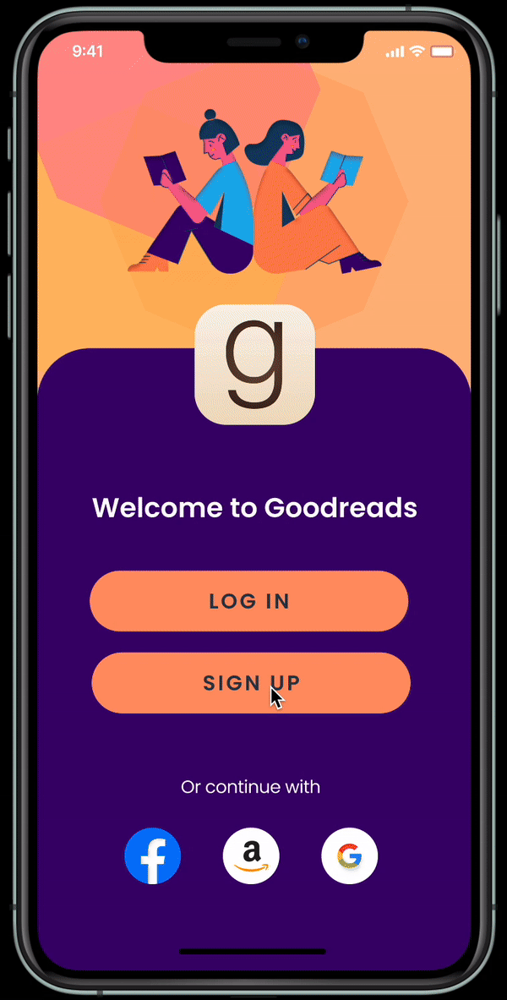

# Goodreads Redesign: A Collaborative UI/UX Project

[View Prototype](https://www.figma.com/proto/RLNOPyBQ6eWlWCAPURgWmj/LF-Wireframe?page-id=0%3A1&node-id=192-2383&node-type=canvas&viewport=1062%2C331%2C0.26&t=L70IPqZsmtaxo4YQ-1&scaling=scale-down&content-scaling=fixed&starting-point-node-id=192%3A2383)

This project represents a collaborative effort with four of my peers to redesign the Goodreads app, serving as my introduction to Figma and the world of UI/UX design. We chose Goodreads due to its popularity among avid readers and the unique challenge presented by its redundant interface, offering an opportunity to address complex UI issues and enhance user experience.

  <table>
    <tr>
      <td></td>
      <td></td>
    </tr>
    <tr>
      <td></td>
      <td></td>
    </tr>
  </table>

Our approach focused on solving key UI challenges, including streamlining navigation, improving content discoverability, and creating a more visually appealing interface. By tackling these issues, we aimed to transform the app's functionality while maintaining its core purpose.

For the UX component, we conducted surveys with Goodreads users to gain insights into their pain points and desired improvements. This user-centered approach allowed us to identify and prioritize features that would significantly enhance the overall user experience.

One of the most challenging aspects of this project was selecting an appropriate color palette. We aimed to create a scheme that offered sufficient versatility for interface design while remaining visually appealing and reducing eye strain. This process involved careful consideration of color theory, accessibility standards, and user preferences to achieve an optimal balance.

Through this redesign, we sought to modernize Goodreads' interface, improve its usability, and create a more engaging platform for book enthusiasts.

